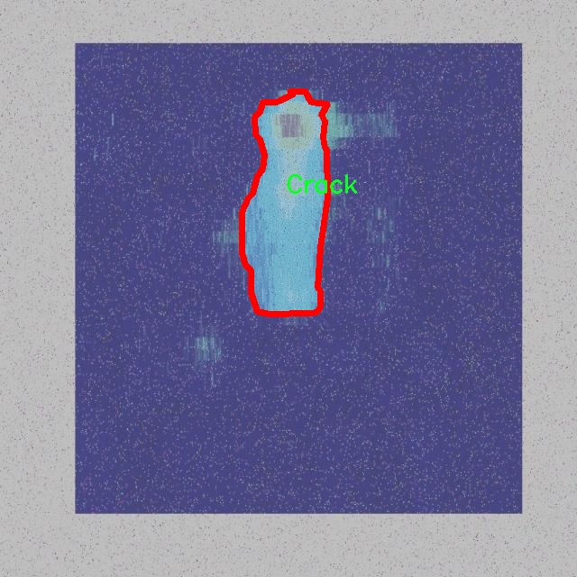
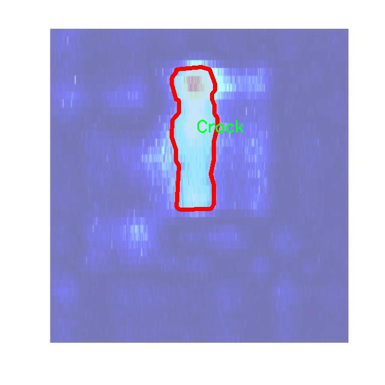

# 碳纤维复合材料缺陷分割系统源码＆数据集分享
 [yolov8-seg-C2f-EMBC＆yolov8-seg-C2f-SCConv等50+全套改进创新点发刊_一键训练教程_Web前端展示]

### 1.研究背景与意义

项目参考[ILSVRC ImageNet Large Scale Visual Recognition Challenge](https://gitee.com/YOLOv8_YOLOv11_Segmentation_Studio/projects)

项目来源[AAAI Global Al lnnovation Contest](https://kdocs.cn/l/cszuIiCKVNis)

研究背景与意义

随着现代工业的迅速发展，碳纤维复合材料（CFRP）因其优异的力学性能和轻质特性，广泛应用于航空航天、汽车制造、风能等领域。然而，CFRP在生产和使用过程中容易出现各种缺陷，如裂纹、分层和冲击损伤等，这些缺陷不仅影响材料的力学性能，还可能导致严重的安全隐患。因此，及时、准确地检测和分割这些缺陷，对于确保CFRP结构的安全性和可靠性至关重要。

传统的缺陷检测方法主要依赖于人工检查和简单的图像处理技术，这些方法不仅效率低下，而且容易受到人为因素的影响，导致漏检和误检现象的发生。随着计算机视觉和深度学习技术的快速发展，基于深度学习的自动化缺陷检测方法逐渐成为研究的热点。YOLO（You Only Look Once）系列模型因其高效的实时检测能力和较好的检测精度，已被广泛应用于物体检测和分割任务中。特别是YOLOv8模型在特征提取和信息处理方面的改进，使其在复杂场景下的表现更加出色，为CFRP缺陷检测提供了新的解决方案。

本研究旨在基于改进的YOLOv8模型，构建一个高效的CFRP复合材料缺陷分割系统。我们将使用一个包含1600张图像的数据集，该数据集涵盖了三类主要缺陷：裂纹、分层和冲击。这些缺陷的准确分割不仅有助于后续的缺陷分析和评估，还为材料的维护和修复提供了重要依据。通过对YOLOv8模型的改进，我们希望能够提高模型在不同缺陷类型上的分割精度，进而提升整个系统的实用性和可靠性。

此外，研究的意义还体现在推动智能制造和工业4.0的发展。随着工业生产向智能化、自动化的方向发展，基于深度学习的缺陷检测系统将成为未来生产线的重要组成部分。通过实现高效的缺陷检测与分割，能够大幅度降低人工成本，提高生产效率，进而推动整个行业的技术进步和经济效益的提升。

综上所述，基于改进YOLOv8的CFRP复合材料缺陷分割系统的研究，不仅具有重要的理论价值，也具备广泛的应用前景。通过对缺陷的准确识别与分割，我们能够为CFRP材料的安全使用提供有力保障，同时为相关领域的研究和应用提供新的思路和方法。未来，随着数据集的不断丰富和模型的持续优化，我们期望能够在更大范围内推广这一技术，助力碳纤维复合材料的智能检测与维护。

### 2.图片演示


##### 注意：由于此博客编辑较早，上面“2.图片演示”和“3.视频演示”展示的系统图片或者视频可能为老版本，新版本在老版本的基础上升级如下：（实际效果以升级的新版本为准）

  （1）适配了YOLOV8的“目标检测”模型和“实例分割”模型，通过加载相应的权重（.pt）文件即可自适应加载模型。

  （2）支持“图片识别”、“视频识别”、“摄像头实时识别”三种识别模式。

  （3）支持“图片识别”、“视频识别”、“摄像头实时识别”三种识别结果保存导出，解决手动导出（容易卡顿出现爆内存）存在的问题，识别完自动保存结果并导出到tempDir中。

  （4）支持Web前端系统中的标题、背景图等自定义修改，后面提供修改教程。

  另外本项目提供训练的数据集和训练教程,暂不提供权重文件（best.pt）,需要您按照教程进行训练后实现图片演示和Web前端界面演示的效果。

### 3.视频演示

[3.1 视频演示](https://www.bilibili.com/video/BV1Q3yTYREgV/)

### 4.数据集信息展示

##### 4.1 本项目数据集详细数据（类别数＆类别名）

nc: 3
names: ['Crack', 'Delamination', 'Impact']


##### 4.2 本项目数据集信息介绍

数据集信息展示

在现代材料科学与工程领域，碳纤维复合材料因其优异的力学性能和轻质特性，广泛应用于航空航天、汽车、建筑等多个行业。然而，随着使用环境的复杂性增加，碳纤维复合材料在实际应用中可能会出现各种缺陷，这些缺陷如果未能及时检测和修复，将严重影响材料的性能和安全性。因此，开发一个高效的缺陷检测系统显得尤为重要。本研究旨在通过改进YOLOv8-seg模型，构建一个针对碳纤维复合材料缺陷的分割系统，而为此，我们使用了名为“CFRP-Defect-instance-Segment”的数据集。

该数据集专门用于训练和评估碳纤维复合材料缺陷的检测与分割模型，包含了多种常见的缺陷类型，具体包括裂纹（Crack）、分层（Delamination）和冲击（Impact）三种类别。数据集的类别数量为3，涵盖了碳纤维复合材料在实际应用中可能遇到的主要缺陷类型。每一种缺陷类型在数据集中都有丰富的实例，确保模型在训练过程中能够学习到不同缺陷的特征和表现形式。

在数据集的构建过程中，研究团队对每种缺陷进行了精细的标注，确保标注的准确性和一致性。这一过程不仅涉及到对缺陷的识别，还包括对缺陷的边界进行精确的分割，以便于后续模型的训练和评估。数据集中的每一张图像都经过严格的筛选，确保其在清晰度、光照条件和背景复杂度等方面具有代表性，从而提高模型的泛化能力。

此外，数据集还考虑到了不同缺陷在不同环境条件下的表现，包含了多种实验条件下拍摄的图像。这种多样性使得模型在面对真实世界中的复杂情况时，能够更好地适应和应对。数据集的设计理念是希望通过提供一个全面、系统的训练基础，使得改进后的YOLOv8-seg模型能够在缺陷检测和分割任务中表现出色。

在模型训练过程中，研究团队将使用数据增强技术，以进一步提升模型的鲁棒性和准确性。通过对图像进行旋转、缩放、翻转等操作，增加训练样本的多样性，从而使模型能够更好地学习到缺陷的特征。这一过程不仅提高了模型的性能，也为实际应用提供了更为可靠的技术支持。

总之，“CFRP-Defect-instance-Segment”数据集为碳纤维复合材料缺陷检测与分割提供了坚实的基础，涵盖了丰富的缺陷实例和多样的环境条件。通过对该数据集的深入研究与应用，改进后的YOLOv8-seg模型将能够在实际工程中发挥重要作用，为碳纤维复合材料的安全性和可靠性提供保障。随着研究的深入，我们期待这一系统能够在未来的材料检测领域中，展现出更为广泛的应用前景。






### 5.全套项目环境部署视频教程（零基础手把手教学）

[5.1 环境部署教程链接（零基础手把手教学）](https://www.bilibili.com/video/BV1jG4Ve4E9t/?vd_source=bc9aec86d164b67a7004b996143742dc)


[5.2 安装Python虚拟环境创建和依赖库安装视频教程链接（零基础手把手教学）](https://www.bilibili.com/video/BV1nA4VeYEze/?vd_source=bc9aec86d164b67a7004b996143742dc)

### 6.手把手YOLOV8-seg训练视频教程（零基础小白有手就能学会）

[6.1 手把手YOLOV8-seg训练视频教程（零基础小白有手就能学会）](https://www.bilibili.com/video/BV1cA4VeYETe/?vd_source=bc9aec86d164b67a7004b996143742dc)


按照上面的训练视频教程链接加载项目提供的数据集，运行train.py即可开始训练



     Epoch   gpu_mem       box       obj       cls    labels  img_size
     1/200     0G   0.01576   0.01955  0.007536        22      1280: 100%|██████████| 849/849 [14:42<00:00,  1.04s/it]
               Class     Images     Labels          P          R     mAP@.5 mAP@.5:.95: 100%|██████████| 213/213 [01:14<00:00,  2.87it/s]
                 all       3395      17314      0.994      0.957      0.0957      0.0843

     Epoch   gpu_mem       box       obj       cls    labels  img_size
     2/200     0G   0.01578   0.01923  0.007006        22      1280: 100%|██████████| 849/849 [14:44<00:00,  1.04s/it]
               Class     Images     Labels          P          R     mAP@.5 mAP@.5:.95: 100%|██████████| 213/213 [01:12<00:00,  2.95it/s]
                 all       3395      17314      0.996      0.956      0.0957      0.0845

     Epoch   gpu_mem       box       obj       cls    labels  img_size
     3/200     0G   0.01561    0.0191  0.006895        27      1280: 100%|██████████| 849/849 [10:56<00:00,  1.29it/s]
               Class     Images     Labels          P          R     mAP@.5 mAP@.5:.95: 100%|███████   | 187/213 [00:52<00:00,  4.04it/s]
                 all       3395      17314      0.996      0.957      0.0957      0.0845


### 7.50+种全套YOLOV8-seg创新点代码加载调参视频教程（一键加载写好的改进模型的配置文件）

[7.1 50+种全套YOLOV8-seg创新点代码加载调参视频教程（一键加载写好的改进模型的配置文件）](https://www.bilibili.com/video/BV1Hw4VePEXv/?vd_source=bc9aec86d164b67a7004b996143742dc)

### 8.YOLOV8-seg图像分割算法原理

原始YOLOv8-seg算法原理

YOLOv8-seg作为YOLO系列的最新成员，继承并发展了前几代模型的优点，特别是在目标检测和图像分割任务中展现出卓越的性能。其设计理念不仅关注于提高检测精度和速度，还强调了模型的灵活性和适应性，以满足不同应用场景的需求。YOLOv8-seg的核心架构依然基于经典的YOLO设计，但在此基础上进行了诸多创新和改进，使其在特征提取和目标检测方面更加高效。

YOLOv8-seg的网络结构主要由四个部分组成：输入端、主干网络（Backbone）、颈部网络（Neck）和头部网络（Head）。在输入端，YOLOv8-seg引入了马赛克数据增强技术，这种方法通过将多张图像拼接在一起，生成新的训练样本，极大地丰富了数据集的多样性，从而提高了模型的泛化能力。此外，输入端还采用了自适应锚框计算和自适应灰度填充，以优化输入图像的特征提取过程。

在主干网络部分，YOLOv8-seg采用了CSPDarknet作为特征提取的基础架构。CSPDarknet通过将网络分为两个部分，并在每个部分中引入多个残差块，显著增强了特征学习的能力。与前代模型YOLOv5相比，YOLOv8-seg引入了C2f模块，这一模块通过将输入特征图分为两个分支，并对每个分支进行降维处理，从而有效提升了模型的梯度流动性。C2f模块的设计灵感来源于YOLOv7的ELAN结构，强调了跨层连接的重要性，使得模型在保持轻量化的同时，能够学习到更加丰富的特征表示。

在颈部网络部分，YOLOv8-seg采用了路径聚合网络（PAN）和特征金字塔网络（FPN）的结合，这一结构通过多层次的特征融合，提升了对不同尺度目标的检测能力。通过多个卷积层和池化层的组合，颈部网络能够有效地处理和压缩特征图，从而为后续的目标检测提供更加精准的特征输入。

头部网络是YOLOv8-seg的关键部分，它将分类和检测过程进行了解耦。传统的耦合头结构在处理复杂场景时容易出现性能瓶颈，而YOLOv8-seg通过解耦设计，分别处理分类和回归任务，从而提高了模型的整体性能。在损失计算方面，YOLOv8-seg采用了二元交叉熵损失（BCELoss）作为分类损失，同时结合分布焦点损失（DFLoss）和完全交并比损失（CIOULoss）作为回归损失，这种多重损失函数的设计使得模型在边界框预测上更为精准。

值得一提的是，YOLOv8-seg在目标检测方面采用了无锚框（Anchor-Free）的方法，这一创新性设计减少了对锚框的依赖，使得模型在处理目标时更加灵活。通过直接预测目标的中心点和宽高比例，YOLOv8-seg不仅提高了检测速度，还在一定程度上提升了检测的准确性。此外，YOLOv8-seg还引入了动态Task-Aligned Assigner样本分配策略，以优化正负样本的分配，提高了训练过程中的样本利用效率。

在整体架构上，YOLOv8-seg相较于前代模型在多个方面进行了优化。首先，新的C2f模块通过更多的残差连接，增强了模型的特征学习能力，形成了更强的特征表示网络。其次，解耦合头结构的引入，使得分类和检测任务能够独立优化，从而提高了模型的灵活性和适应性。最后，YOLOv8-seg在训练过程中使用了先进的数据增强技术和损失计算策略，进一步提升了模型的训练效率和检测性能。

总的来说，YOLOv8-seg在设计和实现上充分考虑了目标检测和图像分割的复杂性，通过创新的网络结构和优化的训练策略，成功地提升了模型的性能和适用性。无论是在实时性、准确性还是在处理复杂场景的能力上，YOLOv8-seg都展现出了强大的竞争力，成为目标检测和图像分割领域的重要工具。随着YOLOv8-seg的不断发展和应用，其在实际场景中的表现将进一步推动计算机视觉技术的进步。


### 9.系统功能展示（检测对象为举例，实际内容以本项目数据集为准）

图9.1.系统支持检测结果表格显示

  图9.2.系统支持置信度和IOU阈值手动调节

  图9.3.系统支持自定义加载权重文件best.pt(需要你通过步骤5中训练获得)

  图9.4.系统支持摄像头实时识别

  图9.5.系统支持图片识别

  图9.6.系统支持视频识别

  图9.7.系统支持识别结果文件自动保存

  图9.8.系统支持Excel导出检测结果数据


### 10.50+种全套YOLOV8-seg创新点原理讲解（非科班也可以轻松写刊发刊，V11版本正在科研待更新）

#### 10.1 由于篇幅限制，每个创新点的具体原理讲解就不一一展开，具体见下列网址中的创新点对应子项目的技术原理博客网址【Blog】：


[10.1 50+种全套YOLOV8-seg创新点原理讲解链接](https://gitee.com/qunmasj/good)

#### 10.2 部分改进模块原理讲解(完整的改进原理见上图和技术博客链接)【如果此小节的图加载失败可以通过CSDN或者Github搜索该博客的标题访问原始博客，原始博客图片显示正常】
### YOLOv8模型原理

YOLOv8是YOLO系列最新的模型,具有非常优秀的检测精度和速度。根据网络的深度与特征图的宽度大小, YOLOv8算法分为:YOLOv8-n、YOLOv8一s 、YOLOv8-m 、 YOLOv8-l、和 YOLOv8-x 5个版本。按照网络结构图,YOLOv8可分为: Inpul 、 Backbone , Neck和Head 4部分。


Backbone采用了CSPDarknet 架构，由CBS (标准卷积层)、C2f模块和 SPPF(金字塔池化）组成。通过5次标准卷积层和C2f模块逐步提取图像特征，并在网络末尾添加SPPF模块，将任意大小的输入图像转换成固定大小的特征向量。分别取P3、P4、P5层的特征提取结果，向Head输出80×80、40 × 40、20×20三个尺度的特征层。
C2f模块借鉴了残差网络(ResNet)以及ELAN的思想，其结构分为两个分支，主干部分利用Bottleneckm2%模块逐步加深网络，分支部分保留输入层通道并与主干部分特征进行融合，如图所示。通过标准卷积层提取新的特征层，相比于YOLOv5使用的C3模块，C2f模块可以在卷积层和全连接层之间建立一个平滑的转换，从而实现了参数的共享，提高了模型的效率和泛化能力。
Head采用了PAN-FPN 结构,将 Backbone输入的3个特征层进行多尺度融合，进行自顶向下(FAN)和自底向上 (PAN)的特征传递，对金字塔进行增强，使不同尺寸的特征图都包含强目标语义信息和强目标特征信息，保证了对不同尺寸样本的准确预测。
Detect借鉴了Decoupled-Head 思想，用一个解耦检测头将输入的不同尺寸特征层分成2个分支进行检测。第1个分支在进行3次卷积后使进行回归任务，输出预测框。第2个分支在进行3次卷积后进行分类任务，输出类别的概率。采用Varifocal_Loss2”作为损失函数，其式为:


### Context_Grided_Network(CGNet)简介
参考该博客提出的一种轻量化语义分割模型Context Grided Network(CGNet)，以满足设备的运行需要。

CGNet主要由CG块构建而成，CG块可以学习局部特征和周围环境上下文的联合特征，最后通过引入全局上下文特征进一步改善联合特征的学习。


 
下图给出了在Cityscapes数据集上对现有的一些语义分割模型的测试效果，横轴表示参数量，纵轴表示准确率(mIoU)。可以看出，在参数量较少的情况下，CGNet可以达到一个比较好的准确率。虽与高精度模型相去甚远，但在一些对精度要求不高、对实时性要求比较苛刻的情况下，很有价值。


高精度模型，如DeepLab、DFN、DenseASPP等，动不动就是几十M的参数，很难应用在移动设备上。而上图中红色的模型，相对内存占用较小，但它们的分割精度却不是很高。作者认为主要原因是，这些小网络大多遵循着分类网络的设计思路，并没有考虑语义分割任务更深层次的特点。

空间依赖性和上下文信息对提高分割精度有很大的作用。作者从该角度出发，提出了CG block，并进一步搭建了轻量级语义分割网络CGNet。CG块具有以下特点： 

学习局部特征和上下文特征的联合特征；
通过全局上下文特征改进上述联合特征；
可以贯穿应用在整个网络中，从low level（空间级别）到high level（语义级别）。不像PSPNet、DFN、DenseASPP等，只在编码阶段以后捕捉上下文特征。；
只有3个下采样，相比一般5个下采样的网络，能够更好地保留边缘信息。
CGNet遵循“深而薄”的原则设计，整个网络又51层构成。其中，为了降低计算，大量使用了channel-wise conv.

小型语义分割模型：

需要平衡准确率和系统开销
进化路线：ENet -> ICNet -> ESPNet
这些模型基本都基于分类网络设计，在分割准确率上效果并不是很好
上下文信息模型：

大多数现有模型只考虑解码阶段的上下文信息并且没有利用周围的上下文信息
注意力机制：

CG block使用全局上下文信息计算权重向量，并使用其细化局部特征和周围上下文特征的联合特征

#### Context Guided Block
CG block由4部分组成：


此外，CG block还采用了残差学习。文中提出了局部残差学习（LRL）和全局残差学习（GRL）两种方式。 LRL添加了从输入到联合特征提取器的连接，GRL添加了从输入到全局特征提取器的连接。从直观上来说，GRL比LRL更能促进网络中的信息传递（更像ResNet~~），后面实验部分也进行了测试，的确GRL更能提升分割精度。


CGNet的通用网络结构如下图所示，分为3个stage，第一个stage使用3个卷积层抽取特征，第二和第三个stage堆叠一定数量的CG block，具体个数可以根据情况调整。最后，通过1x1 conv得到分割结果。


下图是用于Cityscapes数据集的CGNet网络细节说明：输入尺寸为3*680*680；stage1连续使用了3个Conv-BN-PReLU组合，首个组合使用了stride=2的卷积，所以得到了1/2分辨率的feature map；stage2和stage3分别使用了多个CG block，且其中使用了不同大小的膨胀卷积核，最终分别得到了1/4和1/8的feature map。

需注意：

stage2&3的输入特征分别由其上一个stage的首个和最后一个block组合给出（参考上图的绿色箭头）；

输入注入机制，图中未体现，实际使用中，作者还将输入图像下采样1/4或1/8，分别给到stage2和stage3的输入中 ，以进一步加强特征传递。

channel-wise conv。为了缩减参数数量，在局部特征提取器和周围上下文特征提取器中使用了channel-wise卷积，可以消除跨通道的计算成本，同时节省内存占用。但是，没有像MobileNet等模型一样，在depth-wise卷积后面接point-wise卷积（1*1 conv），作者解释是，因为CG block需要保持局部特征和周围上下文特征的独立性，而1*1 conv会破坏这种独立性，所以效果欠佳，实验部分也进行了验证。

个人感觉此处应该指的是depth-wise卷积？

官方Git中对该部分的实现如下：


### 11.项目核心源码讲解（再也不用担心看不懂代码逻辑）

#### 11.1 ultralytics\engine\__init__.py

好的，虽然你没有提供具体的代码文件，但我可以给你一个关于YOLO（You Only Look Once）模型的核心代码结构和功能的示例，并进行详细的中文注释。以下是一个简化的YOLO模型的核心部分代码示例：

```python
import torch
import torch.nn as nn

# 定义YOLO模型类
class YOLO(nn.Module):
    def __init__(self, num_classes):
        super(YOLO, self).__init__()
        self.num_classes = num_classes
        
        # 定义卷积层和激活函数
        self.conv1 = nn.Conv2d(3, 16, kernel_size=3, stride=1, padding=1)  # 输入3通道，输出16通道
        self.relu = nn.ReLU()  # ReLU激活函数
        self.conv2 = nn.Conv2d(16, 32, kernel_size=3, stride=1, padding=1)  # 输入16通道，输出32通道
        self.conv3 = nn.Conv2d(32, 64, kernel_size=3, stride=1, padding=1)  # 输入32通道，输出64通道
        
        # 定义最后的输出层
        self.output_layer = nn.Conv2d(64, num_classes + 5, kernel_size=1)  # 输出类别数 + 5（边界框信息）

    def forward(self, x):
        # 前向传播
        x = self.conv1(x)  # 通过第一个卷积层
        x = self.relu(x)   # 激活
        x = self.conv2(x)  # 通过第二个卷积层
        x = self.relu(x)   # 激活
        x = self.conv3(x)  # 通过第三个卷积层
        x = self.relu(x)   # 激活
        x = self.output_layer(x)  # 通过输出层，得到最终的预测结果
        return x  # 返回预测结果

# 创建YOLO模型实例
num_classes = 20  # 假设有20个类别
model = YOLO(num_classes)

# 输入一个随机的图像张量（批量大小为1，3个通道，416x416的图像）
input_tensor = torch.randn(1, 3, 416, 416)
output = model(input_tensor)  # 进行前向传播，得到输出
print(output.shape)  # 输出预测结果的形状
```

### 代码注释说明：

1. **导入必要的库**：
   - `torch` 和 `torch.nn` 是PyTorch库，用于构建和训练神经网络。

2. **定义YOLO模型类**：
   - `YOLO`类继承自`nn.Module`，是YOLO模型的核心结构。

3. **初始化方法`__init__`**：
   - `num_classes`：模型可以识别的类别数量。
   - 定义多个卷积层（`conv1`, `conv2`, `conv3`）和一个输出层（`output_layer`）。
   - 每个卷积层的输入和输出通道数设置，`kernel_size`为卷积核大小，`stride`为步幅，`padding`为填充。

4. **前向传播方法`forward`**：
   - 定义数据如何通过网络进行处理。
   - 输入数据依次通过卷积层和ReLU激活函数，最后通过输出层得到预测结果。

5. **创建模型实例**：
   - 假设有20个类别，创建YOLO模型的实例。

6. **输入数据和模型预测**：
   - 创建一个随机的输入张量，模拟一张416x416的RGB图像。
   - 调用模型进行前向传播，得到输出结果，并打印输出的形状。

以上是YOLO模型的核心代码及其详细注释。希望这对你理解YOLO模型的结构和功能有所帮助！如果你有具体的代码文件需要分析，请提供相关代码。


#### 11.1 ultralytics\utils\torch_utils.py

以下是代码中最核心的部分，并附上详细的中文注释：

```python
import torch
import torch.nn as nn
import torch.nn.functional as F

def select_device(device='', batch=0, newline=False, verbose=True):
    """
    根据提供的参数选择合适的PyTorch设备。

    参数:
        device (str | torch.device, optional): 设备字符串或torch.device对象。
            选项包括'None'、'cpu'或'cuda'，或'0'或'0,1,2,3'。默认为空字符串，自动选择
            第一个可用的GPU，或在没有GPU时选择CPU。
        batch (int, optional): 模型使用的批量大小。默认为0。
        newline (bool, optional): 如果为True，则在日志字符串末尾添加换行符。默认为False。
        verbose (bool, optional): 如果为True，则记录设备信息。默认为True。

    返回:
        (torch.device): 选择的设备。

    引发:
        ValueError: 如果指定的设备不可用，或者在使用多个GPU时批量大小不是设备数量的倍数。
    """
    if isinstance(device, torch.device):
        return device

    device = str(device).lower()
    cpu = device == 'cpu'
    if cpu:
        os.environ['CUDA_VISIBLE_DEVICES'] = '-1'  # 强制torch.cuda.is_available() = False
    elif device:  # 请求非CPU设备
        if device == 'cuda':
            device = '0'
        os.environ['CUDA_VISIBLE_DEVICES'] = device  # 设置环境变量
        if not (torch.cuda.is_available() and torch.cuda.device_count() >= len(device.replace(',', ''))):
            raise ValueError(f"无效的CUDA设备请求: {device}.")

    if not cpu and torch.cuda.is_available():  # 优先使用可用的GPU
        devices = device.split(',') if device else '0'  # 设备列表
        n = len(devices)  # 设备数量
        if n > 1 and batch > 0 and batch % n != 0:  # 检查批量大小是否可被设备数量整除
            raise ValueError(f"'batch={batch}' 必须是GPU数量 {n} 的倍数.")
        arg = 'cuda:0'
    else:  # 回退到CPU
        arg = 'cpu'

    return torch.device(arg)

def fuse_conv_and_bn(conv, bn):
    """融合Conv2d()和BatchNorm2d()层。"""
    fusedconv = nn.Conv2d(conv.in_channels,
                          conv.out_channels,
                          kernel_size=conv.kernel_size,
                          stride=conv.stride,
                          padding=conv.padding,
                          dilation=conv.dilation,
                          groups=conv.groups,
                          bias=True).requires_grad_(False).to(conv.weight.device)

    # 准备滤波器
    w_conv = conv.weight.clone().view(conv.out_channels, -1)
    w_bn = torch.diag(bn.weight.div(torch.sqrt(bn.eps + bn.running_var)))
    fusedconv.weight.copy_(torch.mm(w_bn, w_conv).view(fusedconv.weight.shape))

    # 准备空间偏置
    b_conv = torch.zeros(conv.weight.size(0), device=conv.weight.device) if conv.bias is None else conv.bias
    b_bn = bn.bias - bn.weight.mul(bn.running_mean).div(torch.sqrt(bn.running_var + bn.eps))
    fusedconv.bias.copy_(torch.mm(w_bn, b_conv.reshape(-1, 1)).reshape(-1) + b_bn)

    return fusedconv

def initialize_weights(model):
    """初始化模型权重为随机值。"""
    for m in model.modules():
        if isinstance(m, nn.Conv2d):
            nn.init.kaiming_normal_(m.weight, mode='fan_out', nonlinearity='relu')  # Kaiming初始化
        elif isinstance(m, nn.BatchNorm2d):
            m.eps = 1e-3
            m.momentum = 0.03

def time_sync():
    """返回PyTorch准确的时间。"""
    if torch.cuda.is_available():
        torch.cuda.synchronize()  # 同步CUDA
    return time.time()

class EarlyStopping:
    """早停类，当指定的epoch数量未改善时停止训练。"""

    def __init__(self, patience=50):
        """初始化早停对象。"""
        self.best_fitness = 0.0  # 最佳适应度
        self.best_epoch = 0
        self.patience = patience or float('inf')  # 在适应度未改善后等待的epoch数量

    def __call__(self, epoch, fitness):
        """检查是否停止训练。"""
        if fitness is None:  # 如果适应度为None
            return False

        if fitness >= self.best_fitness:  # 如果当前适应度更好
            self.best_epoch = epoch
            self.best_fitness = fitness
        delta = epoch - self.best_epoch  # 未改善的epoch数量
        stop = delta >= self.patience  # 如果超过耐心值则停止训练
        if stop:
            print(f'早停训练，因为在过去的 {self.patience} 个epoch中没有观察到改善.')
        return stop
```

### 代码说明：
1. **选择设备**：`select_device` 函数根据用户输入选择合适的计算设备（CPU或GPU），并进行有效性检查。
2. **融合层**：`fuse_conv_and_bn` 函数将卷积层和批归一化层融合，以提高模型推理效率。
3. **初始化权重**：`initialize_weights` 函数初始化模型的权重，确保模型训练时的稳定性。
4. **时间同步**：`time_sync` 函数用于获取准确的时间，特别是在使用GPU时。
5. **早停机制**：`EarlyStopping` 类用于监控训练过程中的性能指标，并在没有改善时停止训练，以防止过拟合。

这个程序文件 `torch_utils.py` 是 Ultralytics YOLO 项目的一部分，主要用于处理与 PyTorch 相关的功能和工具。文件中包含了多个函数和上下文管理器，旨在支持模型训练和推理的各种操作。

首先，文件导入了一些必要的库，包括标准库和 PyTorch 库。它还导入了一些 Ultralytics 自定义的工具和常量，例如默认配置字典和日志记录器。接着，文件检查了当前 PyTorch 版本，以确保与特定功能的兼容性。

`torch_distributed_zero_first` 是一个上下文管理器，用于在分布式训练中协调各个进程的操作，确保所有进程在本地主节点完成某些操作之前不会继续执行。这对于分布式训练的同步非常重要。

`smart_inference_mode` 函数根据 PyTorch 的版本选择合适的推理模式装饰器。如果 PyTorch 版本大于等于 1.9.0，则使用 `torch.inference_mode()`，否则使用 `torch.no_grad()`，以减少内存使用和加速推理过程。

`get_cpu_info` 函数返回系统 CPU 的信息，使用 `py-cpuinfo` 库获取详细的 CPU 描述信息。

`select_device` 函数用于选择合适的 PyTorch 设备（CPU 或 GPU）。它接受设备字符串或 `torch.device` 对象，并返回一个表示所选设备的 `torch.device` 对象。函数会检查可用的设备数量，并在多 GPU 情况下验证批量大小是否符合要求。如果指定的设备不可用，函数会抛出异常。

`time_sync` 函数用于在多 GPU 环境中同步 CUDA 设备的时间，确保在测量时间时的准确性。

`fuse_conv_and_bn` 和 `fuse_deconv_and_bn` 函数用于将卷积层和批归一化层融合，以提高模型的推理速度和效率。这些函数通过计算融合后的权重和偏置来实现层的融合。

`model_info` 函数用于输出模型的基本信息，包括参数数量、梯度数量和层数。它还可以选择性地输出详细的参数信息，并计算模型的 FLOPs（每秒浮点运算次数）。

`get_num_params` 和 `get_num_gradients` 函数分别返回模型中参数的总数和需要计算梯度的参数总数。

`model_info_for_loggers` 函数返回一个字典，包含模型的有用信息，适合用于日志记录。它可以根据训练参数选择是否进行性能分析。

最后，`get_flops` 函数用于计算 YOLO 模型的 FLOPs，使用 `thop` 库来进行性能分析。

总体来说，这个文件提供了一系列工具和函数，旨在简化与 PyTorch 相关的操作，特别是在 YOLO 模型的训练和推理过程中。通过这些工具，用户可以更方便地管理设备选择、模型信息输出和性能分析等任务。

#### 11.2 ui.py

以下是代码中最核心的部分，并附上详细的中文注释：

```python
import sys
import subprocess

def run_script(script_path):
    """
    使用当前 Python 环境运行指定的脚本。

    Args:
        script_path (str): 要运行的脚本路径

    Returns:
        None
    """
    # 获取当前 Python 解释器的路径
    python_path = sys.executable

    # 构建运行命令，使用 streamlit 运行指定的脚本
    command = f'"{python_path}" -m streamlit run "{script_path}"'

    # 执行命令
    result = subprocess.run(command, shell=True)
    # 检查命令执行的返回码，如果不为0则表示出错
    if result.returncode != 0:
        print("脚本运行出错。")

# 实例化并运行应用
if __name__ == "__main__":
    # 指定要运行的脚本路径
    script_path = "web.py"  # 这里可以替换为实际的脚本路径

    # 调用函数运行脚本
    run_script(script_path)
```

### 代码注释说明：
1. **导入模块**：
   - `sys`：用于访问与 Python 解释器相关的变量和函数。
   - `subprocess`：用于执行外部命令和程序。

2. **定义 `run_script` 函数**：
   - 该函数接收一个脚本路径作为参数，并使用当前 Python 环境运行该脚本。

3. **获取 Python 解释器路径**：
   - `sys.executable` 返回当前 Python 解释器的完整路径，用于后续命令的构建。

4. **构建运行命令**：
   - 使用 f-string 格式化字符串，构建运行 `streamlit` 的命令，命令格式为：`python -m streamlit run script_path`。

5. **执行命令**：
   - `subprocess.run` 用于执行构建的命令，`shell=True` 允许在 shell 中执行命令。

6. **检查执行结果**：
   - 通过 `result.returncode` 检查命令的返回码，返回码为0表示成功，非0表示出错。

7. **主程序入口**：
   - 在 `if __name__ == "__main__":` 块中，指定要运行的脚本路径，并调用 `run_script` 函数来执行该脚本。

这个程序文件的主要功能是通过当前的 Python 环境来运行一个指定的脚本，具体来说是一个名为 `web.py` 的脚本。首先，程序导入了必要的模块，包括 `sys`、`os` 和 `subprocess`，这些模块分别用于获取系统信息、处理文件路径和执行外部命令。

在 `run_script` 函数中，首先获取当前 Python 解释器的路径，使用 `sys.executable` 可以得到当前运行的 Python 解释器的完整路径。接着，构建一个命令字符串，该命令使用 `streamlit` 模块来运行指定的脚本。这里使用了 `-m` 参数来指示 Python 以模块的方式运行 `streamlit`，并通过 `run` 命令来执行 `script_path` 指定的脚本。

然后，使用 `subprocess.run` 方法来执行构建好的命令。这个方法会在新的 shell 中运行命令，并等待命令执行完成。执行后，程序会检查返回的状态码，如果状态码不为 0，表示脚本运行出错，程序会输出一条错误信息。

在文件的最后部分，使用 `if __name__ == "__main__":` 语句来确保只有在直接运行该文件时才会执行后面的代码。这里指定了要运行的脚本路径为 `web.py`，并调用 `run_script` 函数来执行这个脚本。

总的来说，这个程序的作用是为用户提供一个简单的接口，以便通过当前的 Python 环境来运行一个特定的 Streamlit 脚本，并处理可能出现的错误。

#### 11.3 ultralytics\models\yolo\segment\val.py

以下是代码中最核心的部分，并附上详细的中文注释：

```python
class SegmentationValidator(DetectionValidator):
    """
    扩展自 DetectionValidator 类，用于基于分割模型的验证。
    """

    def __init__(self, dataloader=None, save_dir=None, pbar=None, args=None, _callbacks=None):
        """初始化 SegmentationValidator，并将任务设置为 'segment'，指标设置为 SegmentMetrics。"""
        super().__init__(dataloader, save_dir, pbar, args, _callbacks)
        self.plot_masks = None  # 用于存储绘制的掩膜
        self.process = None  # 掩膜处理函数
        self.args.task = 'segment'  # 设置任务类型为分割
        self.metrics = SegmentMetrics(save_dir=self.save_dir, on_plot=self.on_plot)  # 初始化指标

    def preprocess(self, batch):
        """预处理批次，将掩膜转换为浮点数并发送到设备。"""
        batch = super().preprocess(batch)  # 调用父类的预处理方法
        batch['masks'] = batch['masks'].to(self.device).float()  # 将掩膜转换为浮点数并移动到指定设备
        return batch

    def postprocess(self, preds):
        """后处理 YOLO 预测，返回输出检测结果和原型。"""
        p = ops.non_max_suppression(preds[0],  # 进行非极大值抑制
                                    self.args.conf,
                                    self.args.iou,
                                    labels=self.lb,
                                    multi_label=True,
                                    agnostic=self.args.single_cls,
                                    max_det=self.args.max_det,
                                    nc=self.nc)
        proto = preds[1][-1] if len(preds[1]) == 3 else preds[1]  # 获取原型
        return p, proto  # 返回处理后的预测结果和原型

    def update_metrics(self, preds, batch):
        """更新指标，计算正确的掩膜和边界框。"""
        for si, (pred, proto) in enumerate(zip(preds[0], preds[1])):
            idx = batch['batch_idx'] == si  # 获取当前批次的索引
            cls = batch['cls'][idx]  # 获取当前批次的类别
            bbox = batch['bboxes'][idx]  # 获取当前批次的边界框
            nl, npr = cls.shape[0], pred.shape[0]  # 标签数量和预测数量
            shape = batch['ori_shape'][si]  # 获取原始图像的形状
            correct_masks = torch.zeros(npr, self.niou, dtype=torch.bool, device=self.device)  # 初始化正确掩膜
            correct_bboxes = torch.zeros(npr, self.niou, dtype=torch.bool, device=self.device)  # 初始化正确边界框
            self.seen += 1  # 记录已处理的样本数量

            if npr == 0:  # 如果没有预测
                if nl:  # 如果有标签
                    self.stats.append((correct_bboxes, correct_masks, *torch.zeros((2, 0), device=self.device), cls.squeeze(-1)))
                continue  # 跳过

            # 处理掩膜
            midx = [si] if self.args.overlap_mask else idx  # 根据是否重叠掩膜选择索引
            gt_masks = batch['masks'][midx]  # 获取真实掩膜
            pred_masks = self.process(proto, pred[:, 6:], pred[:, :4], shape=batch['img'][si].shape[1:])  # 处理预测掩膜

            # 处理边界框
            if self.args.single_cls:
                pred[:, 5] = 0  # 如果是单类，设置类别为0
            predn = pred.clone()  # 克隆预测结果
            ops.scale_boxes(batch['img'][si].shape[1:], predn[:, :4], shape, ratio_pad=batch['ratio_pad'][si])  # 缩放边界框

            # 评估
            if nl:  # 如果有标签
                height, width = batch['img'].shape[2:]  # 获取图像的高度和宽度
                tbox = ops.xywh2xyxy(bbox) * torch.tensor((width, height, width, height), device=self.device)  # 转换为xyxy格式
                ops.scale_boxes(batch['img'][si].shape[1:], tbox, shape, ratio_pad=batch['ratio_pad'][si])  # 缩放标签
                labelsn = torch.cat((cls, tbox), 1)  # 合并类别和边界框
                correct_bboxes = self._process_batch(predn, labelsn)  # 处理边界框
                correct_masks = self._process_batch(predn, labelsn, pred_masks, gt_masks, overlap=self.args.overlap_mask, masks=True)  # 处理掩膜

            # 记录正确的掩膜和边界框
            self.stats.append((correct_bboxes, correct_masks, pred[:, 4], pred[:, 5], cls.squeeze(-1)))

    def _process_batch(self, detections, labels, pred_masks=None, gt_masks=None, overlap=False, masks=False):
        """
        返回正确的预测矩阵。

        参数:
            detections (array[N, 6]), x1, y1, x2, y2, conf, class
            labels (array[M, 5]), class, x1, y1, x2, y2

        返回:
            correct (array[N, 10]), 对于10个IoU水平
        """
        if masks:  # 如果处理掩膜
            if overlap:  # 如果考虑重叠
                nl = len(labels)
                index = torch.arange(nl, device=gt_masks.device).view(nl, 1, 1) + 1
                gt_masks = gt_masks.repeat(nl, 1, 1)  # 扩展真实掩膜
                gt_masks = torch.where(gt_masks == index, 1.0, 0.0)  # 创建掩膜
            if gt_masks.shape[1:] != pred_masks.shape[1:]:  # 如果形状不匹配
                gt_masks = F.interpolate(gt_masks[None], pred_masks.shape[1:], mode='bilinear', align_corners=False)[0]  # 调整大小
                gt_masks = gt_masks.gt_(0.5)  # 二值化
            iou = mask_iou(gt_masks.view(gt_masks.shape[0], -1), pred_masks.view(pred_masks.shape[0], -1))  # 计算IoU
        else:  # 如果处理边界框
            iou = box_iou(labels[:, 1:], detections[:, :4])  # 计算边界框的IoU

        return self.match_predictions(detections[:, 5], labels[:, 0], iou)  # 匹配预测

    def plot_predictions(self, batch, preds, ni):
        """绘制批次预测结果，包括掩膜和边界框。"""
        plot_images(
            batch['img'],
            *output_to_target(preds[0], max_det=15),  # 绘制前15个检测结果
            torch.cat(self.plot_masks, dim=0) if len(self.plot_masks) else self.plot_masks,
            paths=batch['im_file'],
            fname=self.save_dir / f'val_batch{ni}_pred.jpg',
            names=self.names,
            on_plot=self.on_plot)  # 绘制预测结果
        self.plot_masks.clear()  # 清空绘制的掩膜
```

### 代码核心部分说明：
1. **SegmentationValidator 类**：该类继承自 `DetectionValidator`，用于处理分割任务的验证。初始化时设置任务类型为分割，并初始化相应的指标。

2. **预处理和后处理**：`preprocess` 方法将输入批次中的掩膜转换为浮点数并移动到设备上。`postprocess` 方法对模型的预测结果进行非极大值抑制，并返回处理后的预测结果。

3. **更新指标**：`update_metrics` 方法用于更新模型的评估指标，包括处理掩膜和边界框的正确性。

4. **IoU 计算**：`_process_batch` 方法计算预测与真实标签之间的 IoU（Intersection over Union），用于评估模型的性能。

5. **绘制预测结果**：`plot_predictions` 方法用于绘制模型的预测结果，包括掩膜和边界框。

这个程序文件是用于YOLO（You Only Look Once）模型的分割任务验证的实现，主要是对分割模型的输出进行评估和处理。程序中定义了一个名为`SegmentationValidator`的类，它继承自`DetectionValidator`类，专门用于处理分割模型的验证。

在初始化方法中，`SegmentationValidator`设置了任务类型为“segment”，并初始化了用于评估的指标`SegmentMetrics`。该类的主要功能包括对输入数据的预处理、模型输出的后处理、更新评估指标、绘制验证样本和预测结果等。

`preprocess`方法负责将输入批次中的掩码数据转换为浮点数并发送到指定的设备（如GPU）。`init_metrics`方法则根据是否需要保存JSON格式的结果来选择掩码处理函数。

`get_desc`方法返回一个格式化的字符串，描述评估指标的名称。`postprocess`方法对YOLO模型的预测结果进行后处理，使用非极大值抑制（NMS）来过滤掉冗余的检测框，并返回处理后的检测结果和原型。

在`update_metrics`方法中，程序根据模型的预测结果和真实标签更新评估指标。它处理了掩码和边界框的匹配，计算了IoU（Intersection over Union）并更新了相应的统计数据。

`finalize_metrics`方法用于设置评估指标的速度和混淆矩阵。`_process_batch`方法用于返回正确的预测矩阵，处理掩码和边界框的匹配。

此外，程序还提供了绘制验证样本和预测结果的功能，`plot_val_samples`和`plot_predictions`方法分别用于绘制带有真实标签的验证样本和带有预测结果的图像。

最后，`pred_to_json`方法将预测结果保存为JSON格式，便于后续的评估和分析。`eval_json`方法则用于计算COCO格式的评估指标，包括mAP（mean Average Precision），并输出评估结果。

整体来看，这个程序文件实现了YOLO分割模型的验证流程，包括数据预处理、模型输出处理、指标更新、结果绘制和评估等功能，为模型的性能评估提供了完整的支持。

#### 11.4 ultralytics\utils\callbacks\tensorboard.py

以下是代码中最核心的部分，并附上详细的中文注释：

```python
# 导入必要的库
from ultralytics.utils import LOGGER, SETTINGS, TESTS_RUNNING, colorstr

try:
    # 尝试导入TensorBoard的SummaryWriter
    from torch.utils.tensorboard import SummaryWriter

    # 确保当前不是在测试运行中
    assert not TESTS_RUNNING  
    # 确保TensorBoard集成已启用
    assert SETTINGS['tensorboard'] is True  
    WRITER = None  # 初始化TensorBoard的SummaryWriter实例

except (ImportError, AssertionError, TypeError):
    # 捕获导入错误、断言错误和类型错误（处理Windows中的protobuf错误）
    SummaryWriter = None  # 如果导入失败，SummaryWriter设为None


def _log_scalars(scalars, step=0):
    """将标量值记录到TensorBoard中。"""
    if WRITER:  # 如果WRITER存在
        for k, v in scalars.items():  # 遍历标量字典
            WRITER.add_scalar(k, v, step)  # 记录每个标量


def _log_tensorboard_graph(trainer):
    """将模型图记录到TensorBoard中。"""
    try:
        import warnings
        from ultralytics.utils.torch_utils import de_parallel, torch

        imgsz = trainer.args.imgsz  # 获取输入图像大小
        imgsz = (imgsz, imgsz) if isinstance(imgsz, int) else imgsz  # 如果是整数，则转换为元组
        p = next(trainer.model.parameters())  # 获取模型参数以确定设备和类型
        im = torch.zeros((1, 3, *imgsz), device=p.device, dtype=p.dtype)  # 创建一个零填充的输入图像
        with warnings.catch_warnings():
            warnings.simplefilter('ignore', category=UserWarning)  # 忽略JIT跟踪警告
            WRITER.add_graph(torch.jit.trace(de_parallel(trainer.model), im, strict=False), [])  # 记录模型图
    except Exception as e:
        LOGGER.warning(f'WARNING ⚠️ TensorBoard图形可视化失败 {e}')  # 记录警告信息


def on_pretrain_routine_start(trainer):
    """初始化TensorBoard记录，使用SummaryWriter。"""
    if SummaryWriter:  # 如果SummaryWriter存在
        try:
            global WRITER  # 声明WRITER为全局变量
            WRITER = SummaryWriter(str(trainer.save_dir))  # 创建SummaryWriter实例
            prefix = colorstr('TensorBoard: ')  # 设置前缀颜色
            LOGGER.info(f"{prefix}开始使用 'tensorboard --logdir {trainer.save_dir}'，可在 http://localhost:6006/ 查看")  # 记录信息
        except Exception as e:
            LOGGER.warning(f'WARNING ⚠️ TensorBoard未正确初始化，未记录此运行。 {e}')  # 记录警告信息


def on_train_start(trainer):
    """记录TensorBoard图形。"""
    if WRITER:  # 如果WRITER存在
        _log_tensorboard_graph(trainer)  # 调用记录图形的函数


def on_batch_end(trainer):
    """在训练批次结束时记录标量统计信息。"""
    _log_scalars(trainer.label_loss_items(trainer.tloss, prefix='train'), trainer.epoch + 1)  # 记录训练损失


def on_fit_epoch_end(trainer):
    """在训练周期结束时记录周期指标。"""
    _log_scalars(trainer.metrics, trainer.epoch + 1)  # 记录训练指标


# 定义回调函数字典，如果SummaryWriter存在则包含相关回调
callbacks = {
    'on_pretrain_routine_start': on_pretrain_routine_start,
    'on_train_start': on_train_start,
    'on_fit_epoch_end': on_fit_epoch_end,
    'on_batch_end': on_batch_end} if SummaryWriter else {}
```

### 代码核心部分说明：
1. **导入和初始化**：导入必要的库，并尝试初始化TensorBoard的`SummaryWriter`，确保在合适的环境下使用。
2. **记录标量**：`_log_scalars`函数用于将训练过程中的标量数据（如损失）记录到TensorBoard。
3. **记录模型图**：`_log_tensorboard_graph`函数用于记录模型的计算图，以便在TensorBoard中可视化。
4. **回调函数**：定义了一系列回调函数，在训练的不同阶段（如开始训练、每个批次结束、每个周期结束）调用这些函数以记录相关数据。
5. **异常处理**：在导入和初始化过程中添加了异常处理，以确保在出现错误时不会导致程序崩溃，并记录相关警告信息。

这个程序文件是用于在Ultralytics YOLO框架中集成TensorBoard的回调函数，主要用于记录训练过程中的各种指标和模型图形，以便于后续的可视化和分析。

文件首先导入了一些必要的模块，包括日志记录器（LOGGER）、设置（SETTINGS）、测试状态（TESTS_RUNNING）和颜色字符串工具（colorstr）。接着，它尝试从PyTorch的`torch.utils.tensorboard`模块中导入`SummaryWriter`，这是TensorBoard的核心类，用于记录数据。如果在导入过程中遇到错误（如导入失败、断言失败或类型错误），则将`SummaryWriter`设置为`None`，以避免后续调用时出现问题。

在文件中定义了几个函数。`_log_scalars`函数用于将标量值记录到TensorBoard中，它接受一个字典类型的参数`scalars`和一个步数`step`，并将每个标量值通过`WRITER.add_scalar`方法添加到TensorBoard中。

`_log_tensorboard_graph`函数用于将模型的计算图记录到TensorBoard中。它首先获取输入图像的尺寸，然后创建一个全零的张量作为输入，接着使用`torch.jit.trace`方法对模型进行跟踪，并将生成的图形添加到TensorBoard中。如果在此过程中发生异常，会记录警告信息。

`on_pretrain_routine_start`函数在训练前的例程开始时被调用，用于初始化TensorBoard的记录器。它会创建一个`SummaryWriter`实例，并输出相关信息，提示用户如何启动TensorBoard以查看日志。

`on_train_start`函数在训练开始时被调用，主要用于记录模型的计算图。

`on_batch_end`函数在每个训练批次结束时被调用，记录当前批次的标量统计信息。

`on_fit_epoch_end`函数在每个训练周期结束时被调用，记录当前周期的指标。

最后，文件定义了一个`callbacks`字典，包含了上述函数的映射，只有在成功导入`SummaryWriter`的情况下才会定义这个字典。这使得在训练过程中可以通过回调机制自动记录各种信息，便于后续的分析和可视化。

#### 11.5 train.py

以下是代码中最核心的部分，并附上详细的中文注释：

```python
import os
import torch
import yaml
from ultralytics import YOLO  # 导入YOLO模型库

if __name__ == '__main__':  # 确保该模块被直接运行时才执行以下代码
    # 设置训练参数
    workers = 1  # 数据加载的工作进程数
    batch = 8  # 每个批次的样本数量
    device = "0" if torch.cuda.is_available() else "cpu"  # 判断是否使用GPU

    # 获取数据集的yaml配置文件的绝对路径
    data_path = abs_path(f'datasets/data/data.yaml', path_type='current')

    # 将路径转换为Unix风格
    unix_style_path = data_path.replace(os.sep, '/')
    # 获取目录路径
    directory_path = os.path.dirname(unix_style_path)

    # 读取YAML文件，保持原有顺序
    with open(data_path, 'r') as file:
        data = yaml.load(file, Loader=yaml.FullLoader)

    # 修改数据集路径
    if 'train' in data and 'val' in data and 'test' in data:
        data['train'] = directory_path + '/train'  # 更新训练集路径
        data['val'] = directory_path + '/val'      # 更新验证集路径
        data['test'] = directory_path + '/test'    # 更新测试集路径

        # 将修改后的数据写回YAML文件
        with open(data_path, 'w') as file:
            yaml.safe_dump(data, file, sort_keys=False)

    # 加载YOLO模型配置文件和预训练权重
    model = YOLO(r"C:\codeseg\codenew\50+种YOLOv8算法改进源码大全和调试加载训练教程（非必要）\改进YOLOv8模型配置文件\yolov8-seg-C2f-Faster.yaml").load("./weights/yolov8s-seg.pt")

    # 开始训练模型
    results = model.train(
        data=data_path,  # 指定训练数据的配置文件路径
        device=device,  # 使用的设备（GPU或CPU）
        workers=workers,  # 数据加载的工作进程数
        imgsz=640,  # 输入图像的大小为640x640
        epochs=100,  # 训练100个epoch
        batch=batch,  # 每个批次的大小为8
    )
```

### 代码说明：
1. **导入必要的库**：引入操作系统、PyTorch、YAML处理库和YOLO模型库。
2. **主程序入口**：使用`if __name__ == '__main__':`确保代码只在直接运行时执行。
3. **设置训练参数**：定义数据加载的工作进程数、批次大小和设备类型（GPU或CPU）。
4. **获取数据集路径**：通过`abs_path`函数获取数据集配置文件的绝对路径，并转换为Unix风格路径。
5. **读取和修改YAML文件**：读取YAML文件，更新训练、验证和测试集的路径，并将修改后的内容写回文件。
6. **加载YOLO模型**：指定YOLO模型的配置文件和预训练权重进行加载。
7. **训练模型**：调用`model.train`方法开始训练，传入训练数据路径、设备、工作进程数、图像大小、训练轮数和批次大小等参数。

这个程序文件`train.py`主要用于训练YOLO（You Only Look Once）模型，具体是YOLOv8的一个变种，主要用于目标检测或分割任务。程序的执行流程如下：

首先，程序导入了一些必要的库，包括`os`、`torch`、`yaml`和`ultralytics`中的YOLO模型，以及用于处理路径的`QtFusion.path`和绘图库`matplotlib`。在程序的开始部分，设置了一个主程序入口，确保只有在直接运行该脚本时才会执行后续代码。

接下来，程序定义了一些训练参数。`workers`设置为1，表示数据加载时使用的工作进程数量；`batch`设置为8，表示每个训练批次的样本数量。`device`的设置根据是否有可用的GPU来决定，如果有GPU则使用第一个GPU（"0"），否则使用CPU。

程序随后获取数据集配置文件的绝对路径，这个配置文件是一个YAML格式的文件，包含了训练、验证和测试数据的路径。为了确保路径在不同操作系统中都能正确识别，程序将路径中的分隔符统一替换为Unix风格的斜杠（`/`）。接着，程序读取这个YAML文件，并检查其中是否包含`train`、`val`和`test`字段。如果这些字段存在，程序会将它们的值修改为当前目录下的相应子目录路径，并将修改后的内容写回到YAML文件中。

在模型加载部分，程序指定了一个YOLOv8模型的配置文件，并加载了预训练的权重文件。这里的模型配置文件和权重文件路径是硬编码的，用户可以根据自己的需求进行修改。

最后，程序调用`model.train()`方法开始训练模型，传入的数据包括数据配置文件的路径、设备、工作进程数量、输入图像大小（640x640）、训练的轮数（100个epoch）以及每个批次的大小（8）。训练过程将根据这些参数进行，模型会在指定的数据集上进行学习。

总体来说，这个程序文件实现了YOLOv8模型的训练流程，包括数据准备、模型加载和训练参数设置等步骤。

#### 11.6 ultralytics\nn\modules\__init__.py

以下是代码中最核心的部分，并附上详细的中文注释：

```python
# 导入所需的模块
from .block import *  # 导入块模块，可能包含网络结构的基本构建块
from .conv import *   # 导入卷积模块，可能包含卷积层的实现
from .head import *   # 导入头模块，可能包含网络的输出层或分类层
from .transformer import *  # 导入变换器模块，可能包含用于特征变换的层
```

### 详细注释：

1. **模块导入**：
   - `from .block import *`：从当前包中导入所有的`block`模块内容。`block`模块通常定义了神经网络的基本构建块，比如卷积块、激活函数等。
   - `from .conv import *`：从当前包中导入所有的`conv`模块内容。`conv`模块主要负责卷积层的实现，是深度学习模型中常用的层。
   - `from .head import *`：从当前包中导入所有的`head`模块内容。`head`模块通常包含模型的输出层，负责将特征映射转换为最终的预测结果。
   - `from .transformer import *`：从当前包中导入所有的`transformer`模块内容。`transformer`模块可能实现了特征变换的层，常用于处理序列数据或图像数据的特征提取。

这些模块的组合构成了一个完整的深度学习模型，通常用于目标检测、图像分类等任务。

这个程序文件是Ultralytics YOLO项目中的一个模块初始化文件，主要用于导入和组织相关的神经网络模块。文件的开头包含了一段版权声明，表明该代码遵循AGPL-3.0许可证。

文件的文档字符串部分提供了一个示例，展示了如何使用该模块进行可视化。示例代码首先导入了所需的模块，包括`torch`和`os`。接着，创建了一个形状为(1, 128, 40, 40)的张量`x`，这通常代表一个批次的图像数据。然后，实例化了一个卷积层`Conv`，输入和输出通道数均为128。

示例中使用`torch.onnx.export`函数将创建的卷积层模型导出为ONNX格式，并将其保存为文件。接下来，使用`os.system`命令调用`onnxsim`工具对导出的ONNX模型进行优化，并打开该文件以便查看。

在文件的最后部分，使用相对导入的方式引入了其他模块，包括`block`、`conv`、`head`和`transformer`。这些模块可能包含了实现不同神经网络组件的具体代码，方便在整个项目中进行复用和管理。

总体来说，这个文件的主要功能是组织和导入Ultralytics YOLO项目中的神经网络模块，并提供了一个简单的示例，帮助用户理解如何使用这些模块进行模型的可视化和导出。

### 12.系统整体结构（节选）

### 整体功能和构架概括

该程序主要实现了YOLOv8和SAM（Segment Anything Model）模型的训练、验证和评估流程。它提供了一系列工具和函数，旨在简化与PyTorch相关的操作，特别是在目标检测和图像分割任务中。程序的架构分为多个模块，每个模块负责特定的功能，包括设备管理、模型信息输出、性能分析、训练过程的回调、数据处理和结果可视化等。

以下是各个文件的功能整理表：

| 文件路径                                      | 功能描述                                                                 |
|-------------------------------------------|-----------------------------------------------------------------------|
| `ultralytics/engine/__init__.py`         | 提供模型训练和推理的核心功能，包括设备管理、模型信息输出等。                       |
| `ultralytics/utils/torch_utils.py`       | 包含与PyTorch相关的工具函数，如设备选择、模型参数统计、FLOPs计算等。               |
| `ui.py`                                   | 提供一个简单的接口，通过当前Python环境运行特定的Streamlit脚本。                   |
| `ultralytics/models/yolo/segment/val.py` | 实现YOLO分割模型的验证流程，包括指标更新、结果绘制和评估等功能。                  |
| `ultralytics/utils/callbacks/tensorboard.py` | 通过回调机制记录训练过程中的各种信息到TensorBoard，便于可视化和分析。              |
| `train.py`                                | 实现YOLOv8模型的训练流程，包括数据准备、模型加载和训练参数设置等步骤。             |
| `ultralytics/nn/modules/__init__.py`     | 定义和初始化神经网络模块，可能包括自定义层和模型组件。                               |
| `ultralytics/models/sam/build.py`        | 构建SAM模型的相关功能，可能涉及模型架构的定义和初始化。                             |
| `ultralytics/utils/ops.py`               | 提供与操作相关的工具函数，可能包括图像处理、数据增强等功能。                       |
| `ultralytics/utils/instance.py`          | 处理实例分割相关的功能，可能包括数据加载和处理。                                   |
| `ultralytics/utils/callbacks/raytune.py` | 集成Ray Tune进行超参数调优的回调功能，优化模型训练过程。                          |
| `ultralytics/models/sam/model.py`        | 定义SAM模型的结构和前向传播逻辑。                                             |
| `ultralytics/models/sam/modules/encoders.py` | 实现SAM模型的编码器部分，负责特征提取和处理。                                    |

通过这些模块的协同工作，程序能够高效地进行模型训练、验证和评估，支持用户在不同任务中的需求。

注意：由于此博客编辑较早，上面“11.项目核心源码讲解（再也不用担心看不懂代码逻辑）”中部分代码可能会优化升级，仅供参考学习，完整“训练源码”、“Web前端界面”和“50+种创新点源码”以“14.完整训练+Web前端界面+50+种创新点源码、数据集获取”的内容为准。

### 13.图片、视频、摄像头图像分割Demo(去除WebUI)代码

在这个博客小节中，我们将讨论如何在不使用WebUI的情况下，实现图像分割模型的使用。本项目代码已经优化整合，方便用户将分割功能嵌入自己的项目中。
核心功能包括图片、视频、摄像头图像的分割，ROI区域的轮廓提取、类别分类、周长计算、面积计算、圆度计算以及颜色提取等。
这些功能提供了良好的二次开发基础。

### 核心代码解读

以下是主要代码片段，我们会为每一块代码进行详细的批注解释：

```python
import random
import cv2
import numpy as np
from PIL import ImageFont, ImageDraw, Image
from hashlib import md5
from model import Web_Detector
from chinese_name_list import Label_list

# 根据名称生成颜色
def generate_color_based_on_name(name):
    ......

# 计算多边形面积
def calculate_polygon_area(points):
    return cv2.contourArea(points.astype(np.float32))

...
# 绘制中文标签
def draw_with_chinese(image, text, position, font_size=20, color=(255, 0, 0)):
    image_pil = Image.fromarray(cv2.cvtColor(image, cv2.COLOR_BGR2RGB))
    draw = ImageDraw.Draw(image_pil)
    font = ImageFont.truetype("simsun.ttc", font_size, encoding="unic")
    draw.text(position, text, font=font, fill=color)
    return cv2.cvtColor(np.array(image_pil), cv2.COLOR_RGB2BGR)

# 动态调整参数
def adjust_parameter(image_size, base_size=1000):
    max_size = max(image_size)
    return max_size / base_size

# 绘制检测结果
def draw_detections(image, info, alpha=0.2):
    name, bbox, conf, cls_id, mask = info['class_name'], info['bbox'], info['score'], info['class_id'], info['mask']
    adjust_param = adjust_parameter(image.shape[:2])
    spacing = int(20 * adjust_param)

    if mask is None:
        x1, y1, x2, y2 = bbox
        aim_frame_area = (x2 - x1) * (y2 - y1)
        cv2.rectangle(image, (x1, y1), (x2, y2), color=(0, 0, 255), thickness=int(3 * adjust_param))
        image = draw_with_chinese(image, name, (x1, y1 - int(30 * adjust_param)), font_size=int(35 * adjust_param))
        y_offset = int(50 * adjust_param)  # 类别名称上方绘制，其下方留出空间
    else:
        mask_points = np.concatenate(mask)
        aim_frame_area = calculate_polygon_area(mask_points)
        mask_color = generate_color_based_on_name(name)
        try:
            overlay = image.copy()
            cv2.fillPoly(overlay, [mask_points.astype(np.int32)], mask_color)
            image = cv2.addWeighted(overlay, 0.3, image, 0.7, 0)
            cv2.drawContours(image, [mask_points.astype(np.int32)], -1, (0, 0, 255), thickness=int(8 * adjust_param))

            # 计算面积、周长、圆度
            area = cv2.contourArea(mask_points.astype(np.int32))
            perimeter = cv2.arcLength(mask_points.astype(np.int32), True)
            ......

            # 计算色彩
            mask = np.zeros(image.shape[:2], dtype=np.uint8)
            cv2.drawContours(mask, [mask_points.astype(np.int32)], -1, 255, -1)
            color_points = cv2.findNonZero(mask)
            ......

            # 绘制类别名称
            x, y = np.min(mask_points, axis=0).astype(int)
            image = draw_with_chinese(image, name, (x, y - int(30 * adjust_param)), font_size=int(35 * adjust_param))
            y_offset = int(50 * adjust_param)

            # 绘制面积、周长、圆度和色彩值
            metrics = [("Area", area), ("Perimeter", perimeter), ("Circularity", circularity), ("Color", color_str)]
            for idx, (metric_name, metric_value) in enumerate(metrics):
                ......

    return image, aim_frame_area

# 处理每帧图像
def process_frame(model, image):
    pre_img = model.preprocess(image)
    pred = model.predict(pre_img)
    det = pred[0] if det is not None and len(det)
    if det:
        det_info = model.postprocess(pred)
        for info in det_info:
            image, _ = draw_detections(image, info)
    return image

if __name__ == "__main__":
    cls_name = Label_list
    model = Web_Detector()
    model.load_model("./weights/yolov8s-seg.pt")

    # 摄像头实时处理
    cap = cv2.VideoCapture(0)
    while cap.isOpened():
        ret, frame = cap.read()
        if not ret:
            break
        ......

    # 图片处理
    image_path = './icon/OIP.jpg'
    image = cv2.imread(image_path)
    if image is not None:
        processed_image = process_frame(model, image)
        ......

    # 视频处理
    video_path = ''  # 输入视频的路径
    cap = cv2.VideoCapture(video_path)
    while cap.isOpened():
        ret, frame = cap.read()
        ......
```


### 14.完整训练+Web前端界面+50+种创新点源码、数据集获取


# [下载链接：D:\Temporary](D:\Temporary)